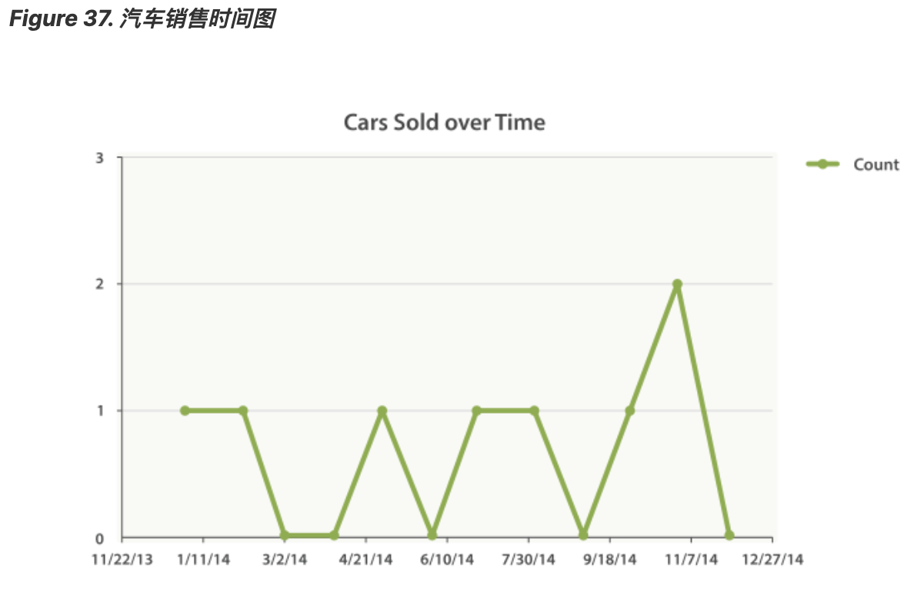

# 返回空 Buckets  
注意到结果末尾处的奇怪之处了吗？

是的，结果没错。 我们的结果少了一些月份！ date_histogram （和 histogram 一样）默认只会返回文档数目非零的 buckets。

这意味着你的 histogram 总是返回最少结果。通常，你并不想要这样。对于很多应用，你可能想直接把结果导入到图形库中，而不想做任何后期加工。

事实上，即使 buckets 中没有文档我们也想返回。可以通过设置两个额外参数来实现这种效果：    
```
GET /cars/transactions/_search
{
   "size" : 0,
   "aggs": {
      "sales": {
         "date_histogram": {
            "field": "sold",
            "interval": "month",
            "format": "yyyy-MM-dd",
            "min_doc_count" : 0, 
            "extended_bounds" : { 
                "min" : "2014-01-01",
                "max" : "2014-12-31"
            }
         }
      }
   }
}
```  
	
这个参数强制返回空 buckets。    
这个参数强制返回整年。    

这两个参数会强制返回一年中所有月份的结果，而不考虑结果中的文档数目。 min_doc_count 非常容易理解：它强制返回所有 buckets，即使 buckets 可能为空。

extended_bounds 参数需要一点解释。 min_doc_count 参数强制返回空 buckets，但是 Elasticsearch 默认只返回你的数据中最小值和最大值之间的 buckets。

因此如果你的数据只落在了 4 月和 7 月之间，那么你只能得到这些月份的 buckets（可能为空也可能不为空）。因此为了得到全年数据，我们需要告诉 Elasticsearch 我们想要全部 buckets， 即便那些 buckets 可能落在最小日期 之前 或 最大日期 之后 。

extended_bounds 参数正是如此。一旦你加上了这两个设置，你可以把得到的结果轻易地直接插入到你的图形库中，从而得到类似 Figure 37, “汽车销售时间图” 的图表。  

