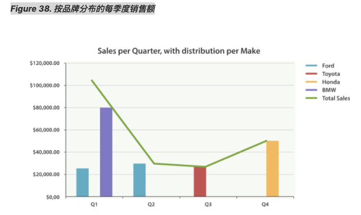

# 扩展例子     
正如我们已经见过很多次，buckets 可以嵌套进 buckets 中从而得到更复杂的分析。 
作为例子，我们构建聚合以便按季度展示所有汽车品牌总销售额。同时按季度、按每个汽车品牌计算销售总额，以便可以找出哪种品牌最赚钱：   
```
GET /cars/transactions/_search
{
   "size" : 0,
   "aggs": {
      "sales": {
         "date_histogram": {
            "field": "sold",
            "interval": "quarter", 
            "format": "yyyy-MM-dd",
            "min_doc_count" : 0,
            "extended_bounds" : {
                "min" : "2014-01-01",
                "max" : "2014-12-31"
            }
         },
         "aggs": {
            "per_make_sum": {
               "terms": {
                  "field": "make"
               },
               "aggs": {
                  "sum_price": {
                     "sum": { "field": "price" } 
                  }
               }
            },
            "total_sum": {
               "sum": { "field": "price" } 
            }
         }
      }
   }
}
```  
	
注意我们把时间间隔从 month 改成了 quarter 。    
计算每种品牌的总销售金额。    
也计算所有全部品牌的汇总销售金额。     

得到的结果（截去了一大部分）如下：    
```
{
....
"aggregations": {
   "sales": {
      "buckets": [
         {
            "key_as_string": "2014-01-01",
            "key": 1388534400000,
            "doc_count": 2,
            "total_sum": {
               "value": 105000
            },
            "per_make_sum": {
               "buckets": [
                  {
                     "key": "bmw",
                     "doc_count": 1,
                     "sum_price": {
                        "value": 80000
                     }
                  },
                  {
                     "key": "ford",
                     "doc_count": 1,
                     "sum_price": {
                        "value": 25000
                     }
                  }
               ]
            }
         },
...
}
```
我们把结果绘成图，得到如 Figure 38, “按品牌分布的每季度销售额” 所示的总销售额的折线图和每个品牌（每季度）的柱状图。    


 