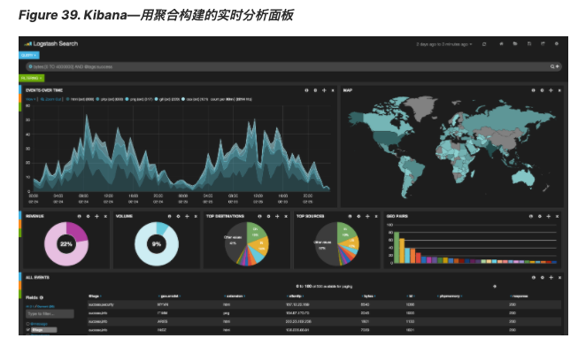

# 潜力无穷   
这些很明显都是简单例子，但图表聚合其实是潜力无穷的。 如 Figure 39, “Kibana—​用聚合构建的实时分析面板” 展示了 Kibana 中用各种聚合构建的面板。    

因为聚合的实时性，类似这样的面板很容易查询、操作和交互。这使得它们成为需要分析数据又不会构建 Hadoop 作业的非技术人员的理想工具。   

当然，为了构建类似 Kibana 这样的强大面板，你可能需要更深的知识，比如基于范围、过滤以及排序的聚合。    