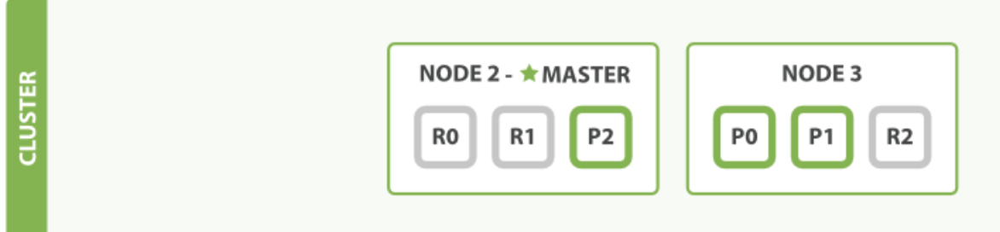

# [应对故障](06_coping_with_failure.md) 
&emsp;&emsp;我们之前说过 Elasticsearch 可以应对节点故障，接下来让我们尝试下这个功能。 
如果我们关闭第一个节点，这时集群的状态为Figure 6, “关闭了一个节点后的集群”  
>Figure 6. 关闭了一个节点后的集群

 
 
 &emsp;&emsp;我们关闭的节点是一个主节点。而集群必须拥有一个主节点来保证正常工作，
 所以发生的第一件事情就是选举一个新的主节点： Node 2 。
 
&emsp;&emsp;在我们关闭 Node 1 的同时也失去了主分片 1 和 2 ，并且在缺失主分片的时候索引也不能正常工作。 
如果此时来检查集群的状况，我们看到的状态将会为 red ：不是所有主分片都在正常工作。
 
&emsp;&emsp;幸运的是，在其它节点上存在着这两个主分片的完整副本， 
所以新的主节点立即将这些分片在 Node 2 和 Node 3 上对应的副本分片提升为主分片， 
此时集群的状态将会为 yellow 。 这个提升主分片的过程是瞬间发生的，如同按下一个开关一般。
 
&emsp;&emsp;为什么我们集群状态是 yellow 而不是 green 呢？ 虽然我们拥有所有的三个主分片，
但是同时设置了每个主分片需要对应2份副本分片，而此时只存在一份副本分片。 
所以集群不能为 green 的状态，不过我们不必过于担心：如果我们同样关闭了 Node 2 ，
我们的程序 依然 可以保持在不丢任何数据的情况下运行，因为 Node 3 为每一个分片都保留着一份副本。
 
&emsp;&emsp;如果我们重新启动 Node 1 ，集群可以将缺失的副本分片再次进行分配，
那么集群的状态也将如Figure 5, “将参数 number_of_replicas 调大到 2”所示。 
如果 Node 1 依然拥有着之前的分片，它将尝试去重用它们，同时仅从主分片复制发生了修改的数据文件。
 
&emsp;&emsp;到目前为止，你应该对分片如何使得 Elasticsearch 进行水平扩容以及数据保障等知识有了一定了解。 
接下来我们将讲述关于分片生命周期的更多细节。    