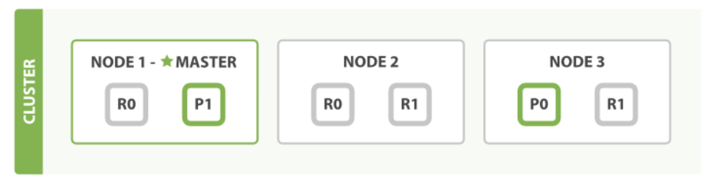

# [主分片和副本分片如何交互](02_how_primary_replica_shards_interact.md) 
&emsp;&emsp;为了说明目的, 我们 假设有一个集群由三个节点组成。 
它包含一个叫 blogs 的索引，有两个主分片，每个主分片有两个副本分片。
相同分片的副本不会放在同一节点，所以我们的集群看起来像 Figure 8, “有三个节点和一个索引的集群”。
>Figure 8. 有三个节点和一个索引的集群

&emsp;&emsp;我们可以发送请求到集群中的任一节点。 每个节点都有能力处理任意请求。 
每个节点都知道集群中任一文档位置，所以可以直接将请求转发到需要的节点上。 
在下面的例子中，将所有的请求发送到 Node 1 ，我们将其称为 协调节点(coordinating node) 。

> Note
>> 当发送请求的时候， 为了扩展负载，更好的做法是轮询集群中所有的节点。