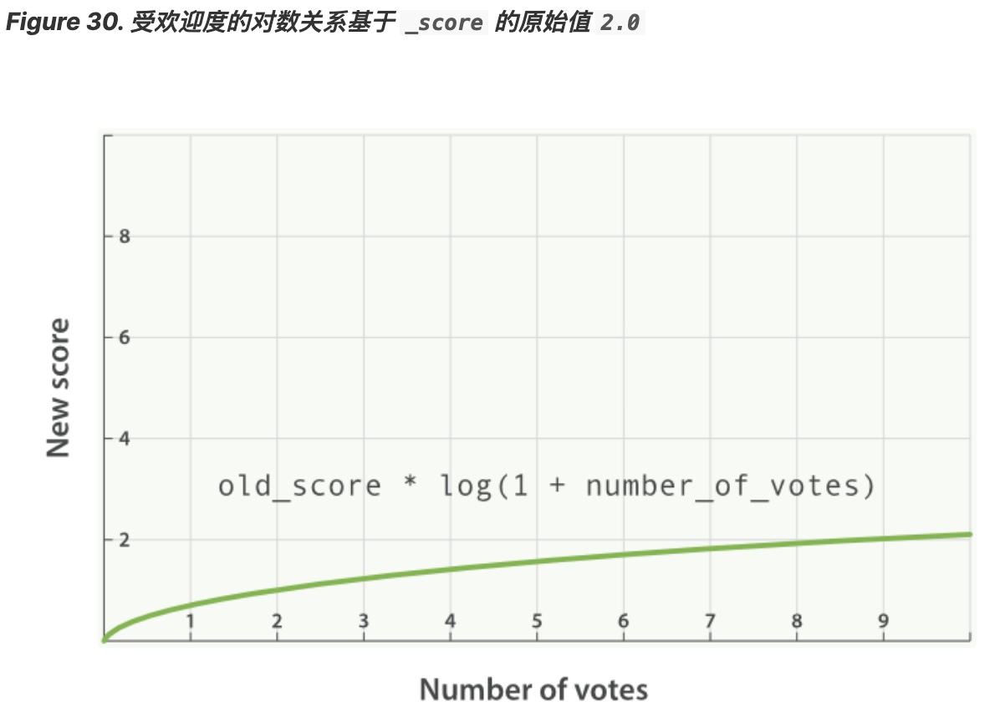

# 按受欢迎度提升权重   
设想有个网站供用户发布博客并且可以让他们为自己喜欢的博客点赞，我们希望将更受欢迎的博客放在搜索结果列表中相对较上的位置，
同时全文搜索的评分仍然作为相关度的主要排序依据，可以简单的通过存储每个博客的点赞数来实现它：    
```
PUT /blogposts/post/1
{
  "title":   "About popularity",
  "content": "In this post we will talk about...",
  "votes":   6
}
```    
在搜索时，可以将 function_score 查询与 field_value_factor 结合使用，即将点赞数与全文相关度评分结合：   
```
GET /blogposts/post/_search
{
  "query": {        
    "function_score": {    (1)
      "query": {           (2)
        "multi_match": {
          "query":    "popularity",
          "fields": [ "title", "content" ]
        }
      },
      "field_value_factor": {  (3)
        "field": "votes"       (4) 
      }
    }
  }
}
```     
(1) function_score 查询将主查询和函数包括在内。   
(2) 主查询优先执行。     
(3) field_value_factor 函数会被应用到每个与主 query 匹配的文档。     
(4) 每个文档的 votes 字段都 必须 有值供 function_score 计算。如果 没有 文档的 votes 字段有值，那么就 必须 使用 [missing 属性](https://www.elastic.co/guide/en/elasticsearch/reference/5.6/query-dsl-function-score-query.html#function-field-value-factor) 
提供的默认值来进行评分计算。 

在前面示例中，每个文档的最终评分 _score 都做了如下修改：

new_score = old_score * number_of_votes
然而这并不会带来出人意料的好结果，全文评分 _score 通常处于 0 到 10 之间，
如下图 Figure 29, “受欢迎度的线性关系基于 _score 的原始值 2.0” 中，
有 10 个赞的博客会掩盖掉全文评分，而 0 个赞的博客的评分会被置为 0 。    
    
    

## modifier  
一种融入受欢迎度更好方式是用 modifier 平滑 votes 的值。换句话说，我们希望最开始的一些赞更重要，
但是其重要性会随着数字的增加而降低。 0 个赞与 1 个赞的区别应该比 10 个赞与 11 个赞的区别大很多。

对于上述情况，典型的 modifier 应用是使用 log1p 参数值，公式如下：

new_score = old_score * log(1 + number_of_votes)
log 对数函数使 votes 赞字段的评分曲线更平滑，如图 Figure 30, “受欢迎度的对数关系基于 _score 的原始值 2.0” ：    

     
带 modifier 参数的请求如下：   
```
GET /blogposts/post/_search
{
  "query": {
    "function_score": {
      "query": {
        "multi_match": {
          "query":    "popularity",
          "fields": [ "title", "content" ]
        }
      },
      "field_value_factor": {
        "field":    "votes",
        "modifier": "log1p"   (1)
      }
    }
  }
}
```    
(1)  modifier 为 log1p 。    

修饰语 modifier 的值可以为： none （默认状态）、 log 、 log1p 、 log2p 、 ln 、 ln1p 、 ln2p 、 square 、 sqrt 以及 reciprocal 。
想要了解更多信息请参照： [field_value_factor 文档](https://www.elastic.co/guide/en/elasticsearch/reference/5.6/query-dsl-function-score-query.html#function-field-value-factor).    

## factor  
可以通过将 votes 字段与 factor 的积来调节受欢迎程度效果的高低：   
```
GET /blogposts/post/_search
{
  "query": {
    "function_score": {
      "query": {
        "multi_match": {
          "query":    "popularity",
          "fields": [ "title", "content" ]
        }
      },
      "field_value_factor": {
        "field":    "votes",
        "modifier": "log1p",
        "factor":   2     (1)
      }
    }
  }
}
```    
(1)  双倍效果。     
添加了 factor 会使公式变成这样：    

new_score = old_score * log(1 + factor * number_of_votes)
factor 值大于 1 会提升效果， factor 值小于 1 会降低效果，如图 Figure 31, “受欢迎度的对数关系基于多个不同因子” 。    

      

## boost_mode  
或许将全文评分与 field_value_factor 函数值乘积的效果仍然可能太大，
我们可以通过参数 boost_mode 来控制函数与查询评分 _score 合并后的结果，参数接受的值为：

 - multiply    
评分 _score 与函数值的积（默认）      
 - sum     
评分 _score 与函数值的和         
 - min    
评分 _score 与函数值间的较小值         
 - max    
评分 _score 与函数值间的较大值         
 - replace   
 函数值替代评分 _score  
 
与使用乘积的方式相比，使用评分 _score 与函数值求和的方式可以弱化最终效果，特别是使用一个较小 factor 因子时：   
```
GET /blogposts/post/_search
{
  "query": {
    "function_score": {
      "query": {
        "multi_match": {
          "query":    "popularity",
          "fields": [ "title", "content" ]
        }
      },
      "field_value_factor": {
        "field":    "votes",
        "modifier": "log1p",
        "factor":   0.1
      },
      "boost_mode": "sum"    (1)
    }
  }
}
```    
将函数计算结果值累加到评分 _score 。    

之前请求的公式现在变成下面这样（参见 Figure 32, “使用 sum 结合受欢迎程度” ）：

new_score = old_score + log(1 + 0.1 * number_of_votes)
      

## max_boost    
最后，可以使用 max_boost 参数限制一个函数的最大效果：   
```
GET /blogposts/post/_search
{
  "query": {
    "function_score": {
      "query": {
        "multi_match": {
          "query":    "popularity",
          "fields": [ "title", "content" ]
        }
      },
      "field_value_factor": {
        "field":    "votes",
        "modifier": "log1p",
        "factor":   0.1
      },
      "boost_mode": "sum",
      "max_boost":  1.5     (1)
    }
  }
}
```   
(1) 无论 field_value_factor 函数的结果如何，最终结果都不会大于 1.5 。     
> 注意   
>> max_boost 只对函数的结果进行限制，不会对最终评分 _score 产生直接影响。  


