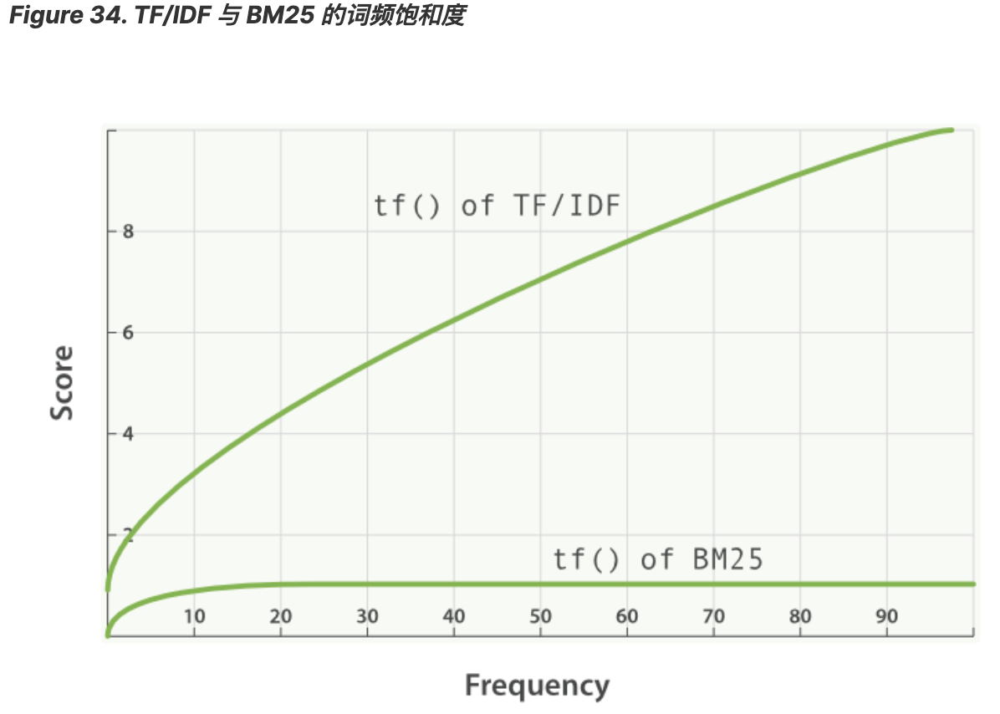

# 可插拔的相似度算法   
在进一步讨论相关度和评分之前，我们会以一个更高级的话题结束本章节的内容：
可插拔的相似度算法（Pluggable Similarity Algorithms）。 
Elasticsearch 将 [实用评分算法](https://www.elastic.co/guide/cn/elasticsearch/guide/current/practical-scoring-function.html)
 作为默认相似度算法，它也能够支持其他的一些算法，这些算法可以参考 [相似度模块](https://www.elastic.co/guide/en/elasticsearch/reference/5.6/index-modules-similarity.html#configuration) 
 文档。   
 ##  Okapi BM25    
 能与 TF/IDF 和向量空间模型媲美的就是 [Okapi BM25](http://en.wikipedia.org/wiki/Okapi_BM25) ，
 它被认为是 当今最先进的 排序函数。 
 BM25 源自 [概率相关模型（probabilistic relevance model）](http://en.wikipedia.org/wiki/Probabilistic_relevance_model) ，
 而不是向量空间模型，
 但这个算法也和 Lucene 的实用评分函数有很多共通之处。
 
 BM25 同样使用词频、逆向文档频率以及字段长归一化，但是每个因子的定义都有细微区别。
 与其详细解释 BM25 公式，倒不如将关注点放在 BM25 所能带来的实际好处上。    
 ## 词频饱和度   
 TF/IDF 和 BM25 同样使用 逆向文档频率 来区分普通词（不重要）和非普通词（重要），
 同样认为（参见 词频 ）文档里的某个词出现次数越频繁，文档与这个词就越相关。
 
 不幸的是，普通词随处可见，实际上一个普通词在同一个文档中大量出现的作用会由于该词在 所有 文档中的大量出现而被抵消掉。
 
 曾经有个时期，将 最 普通的词（或 停用词 ，参见 停用词）从索引中移除被认为是一种标准实践，
 TF/IDF 正是在这种背景下诞生的。TF/IDF 没有考虑词频上限的问题，因为高频停用词已经被移除了。
 
 Elasticsearch 的 standard 标准分析器（ string 字段默认使用）不会移除停用词，
 因为尽管这些词的重要性很低，但也不是毫无用处。这导致：在一个相当长的文档中，
 像 the 和 and 这样词出现的数量会高得离谱，以致它们的权重被人为放大。
 
 另一方面，BM25 有一个上限，文档里出现 5 到 10 次的词会比那些只出现一两次的对相关度有着显著影响。
 但是如图 TF/IDF 与 BM25 的词频饱和度 所见，文档中出现 20 次的词几乎与那些出现上千次的词有着相同的影响。
 
 这就是 非线性词频饱和度（nonlinear term-frequency saturation） 。      
   
       
 ##  字段长归一化    
 在 [字段长归一化](https://www.elastic.co/guide/cn/elasticsearch/guide/current/scoring-theory.html#field-norm) 
 中，我们提到过 Lucene 会认为较短字段比较长字段更重要：
 字段某个词的频度所带来的重要性会被这个字段长度抵消，但是实际的评分函数会将所有字段以同等方式对待。
 它认为所有较短的 title 字段比所有较长的 body 字段更重要。
 
 BM25 当然也认为较短字段应该有更多的权重，但是它会分别考虑每个字段内容的平均长度，
 这样就能区分短 title 字段和 长 title 字段。
 > Tip 
>> 在 [查询时权重提升](https://www.elastic.co/guide/cn/elasticsearch/guide/current/query-time-boosting.html) 
>> 中，已经说过 title 字段因为其长度比 body 字段 自然 有更高的权重提升值。
由于字段长度的差异只能应用于单字段，这种自然的权重提升会在使用 BM25 时消失。   

##  BM25   
不像 TF/IDF ，BM25 有一个比较好的特性就是它提供了两个可调参数：

 - k1    
这个参数控制着词频结果在词频饱和度中的上升速度。默认值为 1.2 。值越小饱和度变化越快，值越大饱和度变化越慢。    
 - b    
这个参数控制着字段长归一值所起的作用， 0.0 会禁用归一化， 1.0 会启用完全归一化。默认值为 0.75 。    

在实践中，调试 BM25 是另外一回事， k1 和 b 的默认值适用于绝大多数文档集合，但最优值还是会因为文档集不同而有所区别，
为了找到文档集合的最优值，就必须对参数进行反复修改验证。   